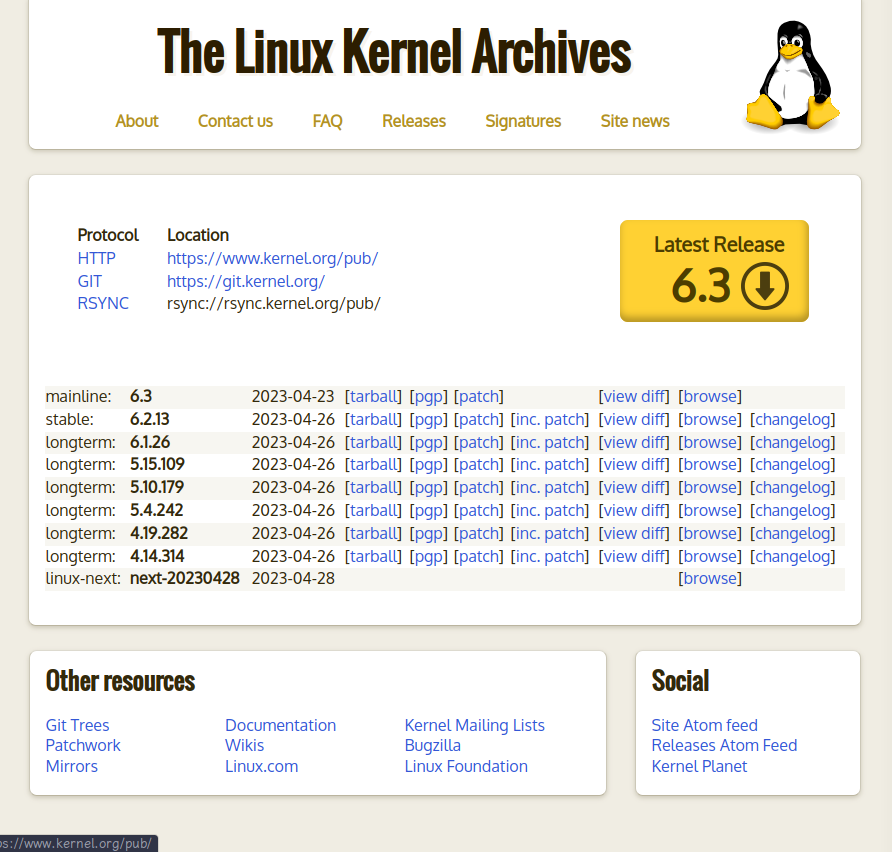
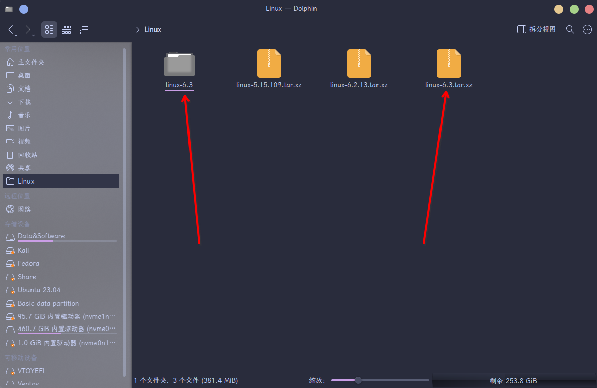
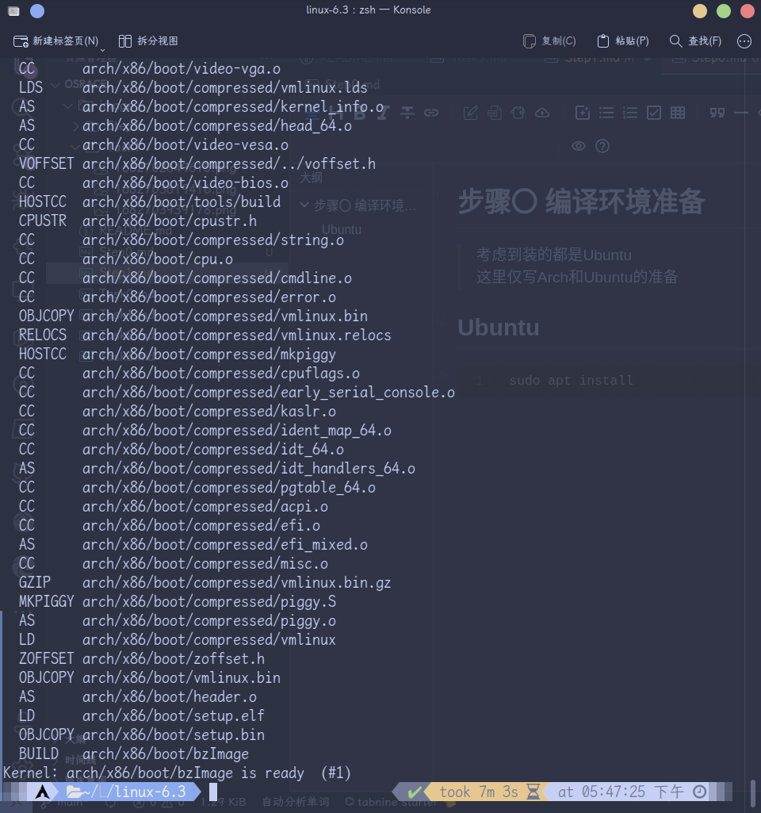
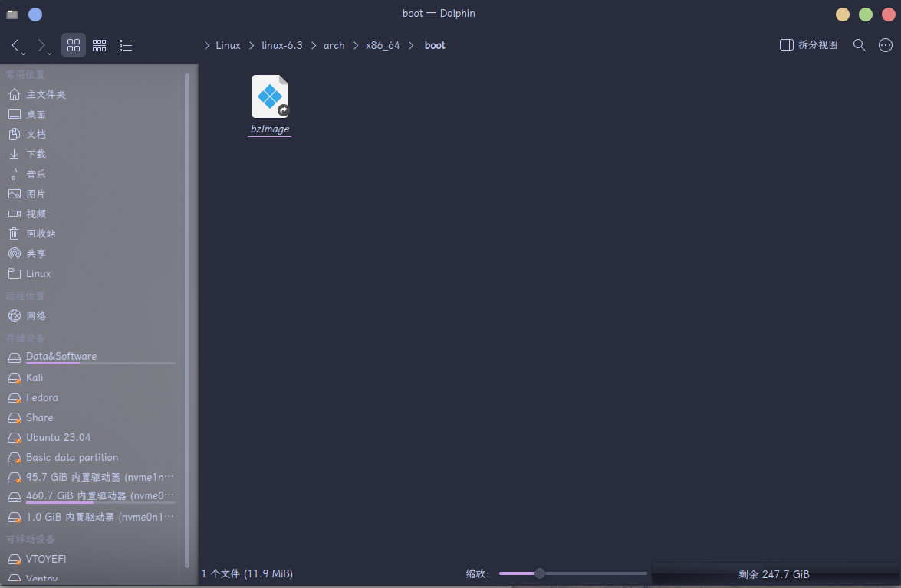

# 步骤一 编译 Linux 内核

如若需要返回主页，请点击这里：
[预安装系统的构建](./README.md)

如果还没配置好编译环境请移步这里
[步骤〇 编译环境准备](./Step0.md)

## 首先到官网下载内核源码

[Linux Kernel 官网](https://kernel.org/)


> 本例选择 Linux 6.3 的内核进行编译

下载好后，双击压缩包进行解压（亦可在命令行中使用 tar 命令解压）

```bash
tar -xvJf xxx.tar.xz
```



如图所示，左边的文件夹为解压后的文件夹，右边的为压缩包
以上应该算是废话

打开命令行（linux 下的快捷键通常是 Ctrl + Alt + T）
记忆方式就是 T 是 Terminal 的开头

```bash
cd <LinuxKernelSourceDir>
```

LinuxKernelSourceDir 为你解压的 linux 源码的文件夹

```bash
export ARCH=x86_64
# 配置架构为x86_64
```

```bash
make x86_64_defconfig
# 设置board config
# 会默认生成适用于x86_64架构相关的选项
```

```bash
make menuconfig
# 在上一步基础上配置要编译的内核的一些选项
```

这边注意要添加对块设备的支持
在界面中，选择General setup
然后在进去的界面里选择 Initial RAM filesystem and RAM disk (initramfs/initrd) support

接着退出来到主界面，选择Device Drivers
选择Block Devices, 勾选其RAM block device support选项
并在其子项 Default RAM disk size 写入65536
接着保存退出


```bash
make
# 编译
# 亦可为如下所示
make -jx
# x是线程数
```

注意，若之前编译过源码，出错或者想要重新配置编译
需要输入如下命令,清理之前的编译结果
```bash
make mrproper
```
然后再执行编译


接下来可以离开电脑休息一会儿或者玩你的其他电子设备或者看书
总之就是先去干别的事情，编译这个东西需要一定时间
实测我编译这个默认配置用了 7 分钟多一些



编译好的镜像在如下位置



## 下一步 [步骤一 构建 Debian 预安装系统](./Step2.1.md)
