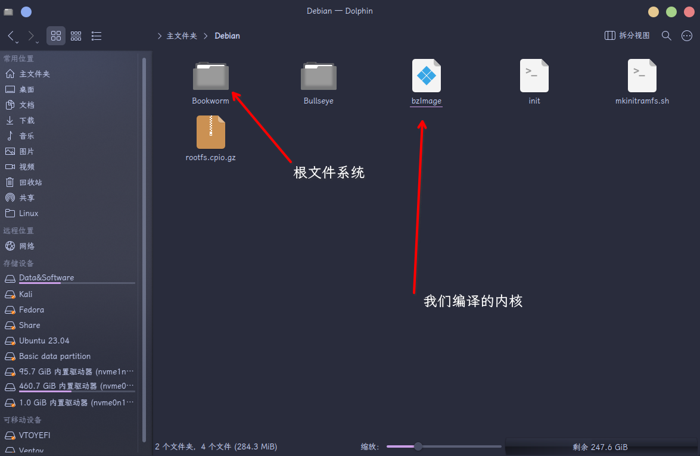

# 步骤二之一 构建 Debian 预安装系统

如若需要返回主页，请点击这里：
[预安装系统的构建](./README.md)

### 2.1.1 下载 Debootstrap

> &emsp;Debootstrap 是一个用于在 Debian 或 Ubuntu 系统上创建基于 Debian 或 Ubuntu 系统的最小化安装环境的工具。它可以在任何 Debian 或 Ubuntu 系统上运行，甚至可以在非 Debian 或 Ubuntu 的 Linux 发行版上运行。
>
> &emsp;使用 Debootstrap，用户可以创建一个裸机的 Debian 或 Ubuntu 系统，然后添加所需的软件包和配置，从而构建自己的定制化系统。Debootstrap 还支持不同的架构和发行版，用户可以选择安装不同版本的 Debian 或 Ubuntu，并为不同的硬件平台编译安装系统。
>
> &emsp;使用 Debootstrap 创建的最小化系统非常轻巧，通常只包含最基本的系统工具和必需的软件包。这使得它在嵌入式系统、虚拟机、容器和云环境中非常有用。另外，Debootstrap 还可以用于系统修复和故障排除，用户可以使用它在独立的分区或硬盘上安装一个新的系统，从而解决已有系统的问题。

#### Ubuntu

```bash
sudo apt install debootstrap
```

#### Arch

```bash
sudo pacman -S debootstrap
```

---

### 2.1.2 创建文件夹，用于根文件系统

```bash
cd
mkdir -p Debian/Bookworm
# 这里的Bookworm和Debian可以随便取，为了方便识别取的这两个名字
# 其中Debian是我们现在根文件系统用到的源，Bookworm是Debian最新的版本
```

&emsp;第一条命令是进入家目录，~关于家目录这个概念，自行百度~

> 在 Linux 系统中，每个用户都有一个个人目录，通常称为家目录（Home Directory），该目录是用户的默认工作目录，也是用户的私人空间。家目录通常存储用户的个人文件、配置文件、桌面图标等。
>
> 在大多数 Linux 发行版中，家目录的默认路径为 /home/username，其中 username 是当前用户的用户名。例如，如果当前用户的用户名为 user1，则该用户的家目录路径为 /home/user1。

&emsp;第二条命令是在当前目录下创建两个文件夹，一个是 Debian,另一个是 Bookworm，Bookworm 为 Debian 的子目录
&emsp;其中 -p 选项代表创建目录时自动创建所需的上级目录
&emsp;就比方说， 在执行上面那条 mkdir 命令的时候，如果没有 Debian 这个目录的话，命令行就会提示找不到那个目录，所以需要用到 -p 选项

> 可以用 pwd 显示当前工作目录

进入创建的目录

```bash
cd Debian/Bookworm
```

---

### 2.1.3 创建 Debian 根文件系统

在命令行中执行如下命令

```bash
sudo debootstrap bookworm ./ https://mirrors.ustc.edu.cn/debian/
```

这条命令的含义是，在 ./（当前目录） 目录下，使用 debootstrap 工具，
利用 USTC 中科大的 Debian 源，创建版本为 Bookworm 的根文件系统


如图所示，花了两分半钟时间创建好，时间受网络和硬件影响

这个时候可以提前进入 Bookworm 系统看看

```bash
sudo chroot ./ ./bin/bash
```

这时候执行 pwd 就会发现命令行显示的是根目录，说明根目录已经切换成了 Bookworm 根文件系统的根目录

```bash
apt install neofetch ssh aptitude
# 安装neofetch ssh aptitude 软件包
```

这里不需要使用 sudo 的原因是因为 chroot 到新的根文件系统内后，你就是 root 用户

```bash
neofetch
```

看一下 logo 变成了 Debian
说明根文件系统已经构建好


然后我们需要改一下 root 用户的密码

```bash
passwd
```


按提示操作即可

一切结束后，输入 Ctrl+D 或者 exit 可以退出 Debian 根文件系统，回到原来的系统

---

### 2.1.4 打包根文件系统

根据官方的文档，建立以下两个文件

[Linux 内核文档(根文件系统)](https://www.kernel.org/doc/Documentation/filesystems/ramfs-rootfs-initramfs.txt)

#### 2.1.4.1 init 文件

首先进入上级目录，即 Debian 目录

```bash
cd ..
```

然后在命令行输入以下命令创建并编辑 init 文件

```bash
sudo vim ./init
# 如果不会用vim就使用gedit
sudo gedit ./init
```

在打开的编辑器里面粘贴以下内容

```bash
#!/bin/bash
# devtmpfs does not get automounted for initramfs
echo "******** init **********"
/bin/mount -t devtmpfs devtmpfs /dev
exec 0</dev/console
exec 1>/dev/console
exec 2>/dev/console
exec /sbin/init $*
```

保存退出

#### 2.1.4.2 mkinitramfs.sh 文件

退出后，创建一个脚本文件用于打包 initramfs

```bash
sudo vim ./mkinitramfs.sh
# 如果不会用vim就使用gedit
sudo gedit ./mkinitramfs.sh
```

在打开的编辑器里面粘贴以下内容

```bash
#!/bin/bash
# Copyright 2006 Rob Landley <rob@landley.net> and TimeSys Corporation.
# Licensed under GPL version 2
if [ $# -ne 2 ]
then
  echo "usage: mkinitramfs directory imagename.cpio.gz"
  exit 1
fi
if [ -d "$1" ]
then
  echo "creating $2 from $1"
  (cd "$1"; find . | cpio -o -H newc | gzip) > "$2"
else
  echo "First argument must be a directory"
  exit 1
fi
```

保存退出

然后将上一步创建的 init 文件放到根文件系统的目录下
如下图所示


#### 2.1.4.3 打包根文件系统

退出后，在终端输入如下 命令

```bash
sudo bash ./mkinitramfs.sh Bookworm rootfs.cpio.gz
```


---

### 2.1.5 启动根文件系统

然后，现在要用到我们在步骤一中编译的 Linux 内核了
[步骤一 编译 Linux 内核](./Step1.md)

目录结构应该是在你解压的文件夹里的如下图所示的位置


我们将该文件复制到 Debian 目录下



注意本例的 Debian 目录位于家目录下，
编译的内核位于如下位置
这里的 xein 是我的用户名，不要产生不必要的误会

去你当时解压 Linux 源码并编译 linux 源码的地方按这个结构找到你编译的内核


然后回到Debian目录下

先看看当前目录是不是要的位置


然后是本节的最后一步，通过 qemu 启动我们自己编译的内核和 Debian 根文件系统

在命令行内，输入如下命令（我假设你已经在命令行里进入了 Debian 目录）

```bash
qemu-system-x86_64  -kernel bzImage -initrd rootfs.cpio.gz  /dev/zero -m 2G -append "console=ttyS0" -nographic
```

如果遇到不能启动的情况，可以根据qemu中的报错信息进行修改，其中2G可能需要改大一点


成功使用 qemu 启动了 Debian 根文件系统

然后再在终端里面输入 neofetch 看一下系统信息

```bash
neofetch
```


可以看到显示的内核是我们之前编译的内核，
另外提一下，我们之前编译内核是可以自己取名字的

按Ctrl+A，再按一下X,就可以推出qemu

本节到此结束