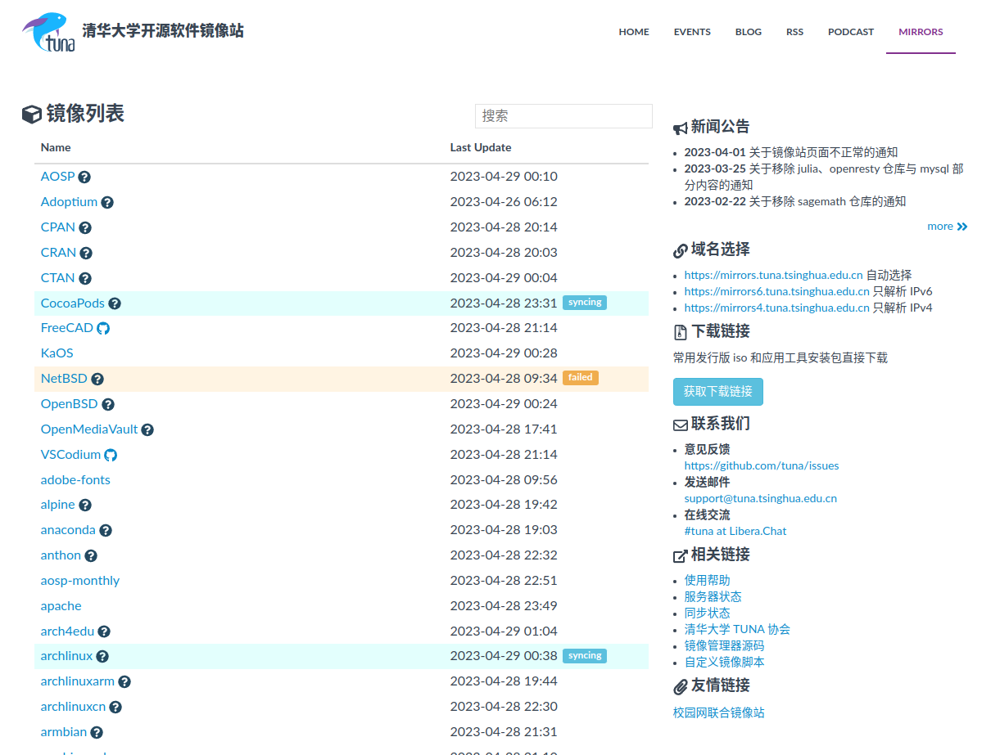
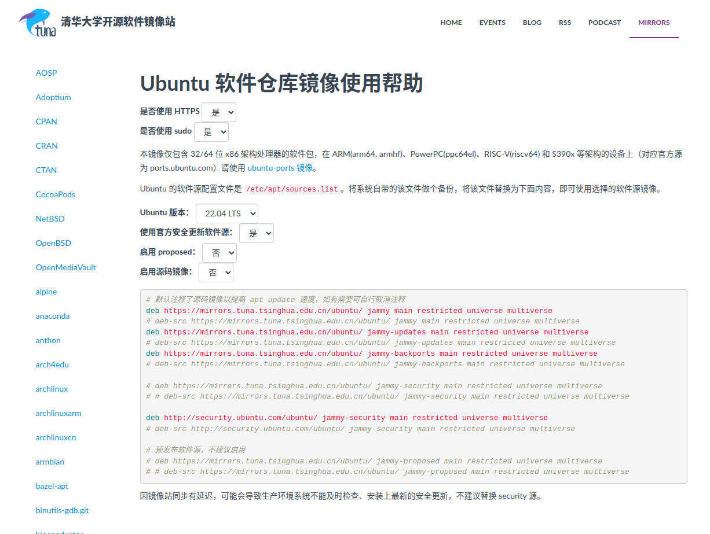

# 任务一 更换镜像源

如若需要返回主页，请点击这里：
[预安装系统的构建](./README.md)

> &emsp;镜像源是指存储软件包和更新的服务器，用户可以从该服务器上下载所需的软件包和更新。更换镜像源可以帮助用户提高软件下载和更新的速度，并且有时也可以解决某些软件包下载失败的问题。

## 1. 国内几个常用的镜像源

- USTC 中科大镜像源
  [https://mirrors.ustc.edu.cn/](https://mirrors.ustc.edu.cn/)
- TUNA 清华大学镜像源
  [https://mirrors.tuna.tsinghua.edu.cn/](https://mirrors.tuna.tsinghua.edu.cn/)
- 腾讯镜像源
  [https://mirrors.tencent.com/](https://mirrors.tencent.com/)
- 电专镜像源
  [https://linux.xidian.edu.cn/](https://linux.xidian.edu.cn/)

> &emsp;一般进入镜像站之后，你搜索指定的发行版(没搜索框就按 Ctrl+F)，旁边筛选结果旁边都会有个问号图标，点击那个一般就是跳出一个教你怎么配置镜像源的网页。



比方说在搜索框里面输入 Ubuntu，然后点击 Ubuntu 旁边的问号，就可以进入帮助页面


按里面的说明进行操作就行了
注意，更改里面说的那个文件需要 sudo 权限

```
# 用vim编辑器打开指定文件，并且使用sudo权限
sudo vim xxx
```

然后再用**vim**的常规操作进行修改就行了
**vim**也有一些相关教程，不过有一定学习成本，如果实在不习惯可以使用**gedit**编辑器或者**kate**编辑器等。

> **gedit**应该是 Ubuntu 使用 Gnome 桌面环境的时候自带的
> **kate**是使用 KDE 桌面环境的时候自带的（一般情况下）
> 当然你也可以使用 nano,这玩意儿也挺简单的，不过我没深入学过，感觉编辑器如果使用稍微熟练的话 Vim 是最好用的。

Debian 系（包括 Ubuntu） 下安装 Vim 的命令

```bash
sudo apt install vim
```

Arch 系下安装 Vim 的命令

```bash
sudo pacman -S vim
```

&emsp;这里你应该注意到了 Debian 系和 Arch 系下安装 Vim 的命令并不相同
&emsp;这是因为两者的包管理器并不一样（当然你也可以选择那种应用商店式的安装方法，不过我感觉没有命令行安装方便）

最后改完镜像源的时候，要记得更新一下镜像源

```bash
sudo apt update
```

然后再更新一下系统

```bash
sudo apt upgrade
```

### 1.1 包管理器

> &emsp;包管理器又称软件包管理系统，它是在电脑中自动安装、配制、卸载和升级软件包的工具组合，在各种系统软件和应用软件的安装管理中均有广泛应用。
> ——来源于《百度百科》

&emsp;包管理器就像是一个虚拟的“应用商店”，类似于手机操作系统中的应用商店，用户可以在其中轻松地搜索、安装、更新、卸载各种软件。不同的发行版就相当于不同的手机品牌，每个品牌可能有自己的应用商店，但基本功能是一样的。而各种软件包就相当于应用商店中的各种应用程序，用户可以选择安装自己需要的软件包。和应用商店类似，包管理器还会提供软件包的描述、评价和反馈等信息，帮助用户更好地选择和管理软件包。

#### 1.1.1 常见的包管理器

- Debian 系
  apt dpkg
- Arch 系
  pacman yay yaourt paru pacmac
- RHEL 系
  yum
- SUSE
  zypper

### 1.2 软件包

那软件包是啥？
~~听名字应该就知道是啥玩意了，没必要写吧~~

> &emsp;在计算机科学中，软件包（Software Package）是指一个或多个相关的计算机程序，它们被组织成一个可重复安装的单元，通常包含软件的二进制文件、配置文件、文档等相关文件，以及描述软件包的元数据信息等。软件包是计算机系统中软件管理的基本单位，通过软件包可以方便地管理和分发软件。
> &emsp;一般来说，软件包由软件开发人员或社区维护者打包制作，然后由包管理器进行安装、升级和卸载等操作。不同的软件包可能针对不同的操作系统、不同的架构、不同的软件版本等进行制作和打包，用户可以根据自己的需求选择和安装合适的软件包。
> &emsp;常见的软件包格式有 deb、rpm、tar、zip 等，不同的操作系统和发行版使用的软件包格式也不尽相同。
