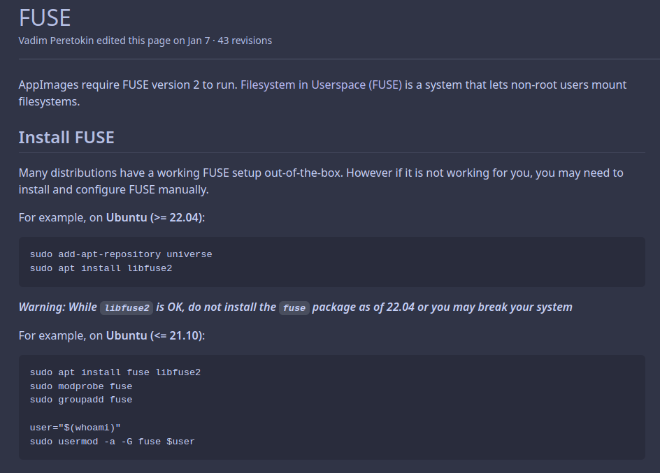

# 任务二    配置代理环境

## 1. 配置代理环境

### 1.1 下载Qv2ray.Appimage

#### 1.1.1 Ubuntu下使用Appimage可能会报错

根据Appimage官网的Wiki：
https://github.com/AppImage/AppImageKit/wiki/FUSE


注意22.04及以上不要安装fuse,要不然可能得重装Ubuntu
```bash
sudo apt install libfuse2
```
